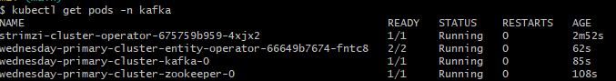

Siga os passos abaixo para execucao do kafka dentro do ambiente do kubernetes, certifique-se de ter o Kubernetes devidamente configurado.

1 - Criando o namespace que iremos utilizar
    - kubectl create namespace kafka

2 - Adicionando repositorios ao helm
    - helm repo add strimzi https://strimzi.io/charts/
    - helm repo update

    O comando abaixo ira apoiar na identificacao das versoes disponiveis dentro do repo adicionado, neste exemplo iremos seguir com a versao 0.43.0 do strimzi

    - helm search repo strimzi

3 - Realizando a instalacao
    - helm install strimzi-cluster-operator strimzi/strimzi-kafka-operator -n kafka --version 0.43.0
    utiliza o comando abaixo para validar a execucao do pod
    - kubectl get pods -n kafka

4 - Inicializando Broker do Kafka
    Utilize o arquivo kafka_broker.yaml para inicializar o broker do kafka
    - kubectl apply -f kafka_broker.yaml -n kafka

    utilize o comando abaixo para acompanhar a criacao dos pods
        - kubectl get pods -n kafka -w

    

5 - Criando topicos de exemplo
    
    - kubectl create -f kafka_titles_topic.yaml -n kafka
    - kubectl create -f kafka_ratings_topic.yaml -n kafka

    Validando criacao dos topicos
    - kubectl get kafkatopic -n kafka

6 - Identificando Endereco do Servidor de Bootstrap
    O comando abaixo ira expor o endereco em que o nosso servidor de bootstrap esta rodando

    - kubectl get kafka wednesday-primary-cluster -o=jsonpath='{.status.listeners[*].bootstrapServers}{"\n"}'  -n kafka

    output da linha acima:
    wednesday-primary-cluster-kafka-bootstrap.kafka.svc:9092 wednesday-primary-cluster-kafka-bootstrap.kafka.svc:9093 localhost:32100

    utilizaremos o valor wednesday-primary-cluster-kafka-bootstrap.kafka.svc:9092 para encontrar o cluster do kafka dentro do kubernetes,
    dentro da secao do kupyter teremos alguns exemplos de envio e consumo de dados dos topicos do kafka

    kubectl port-forward -n kafka wednesday-primary-cluster-0 9092:9092

